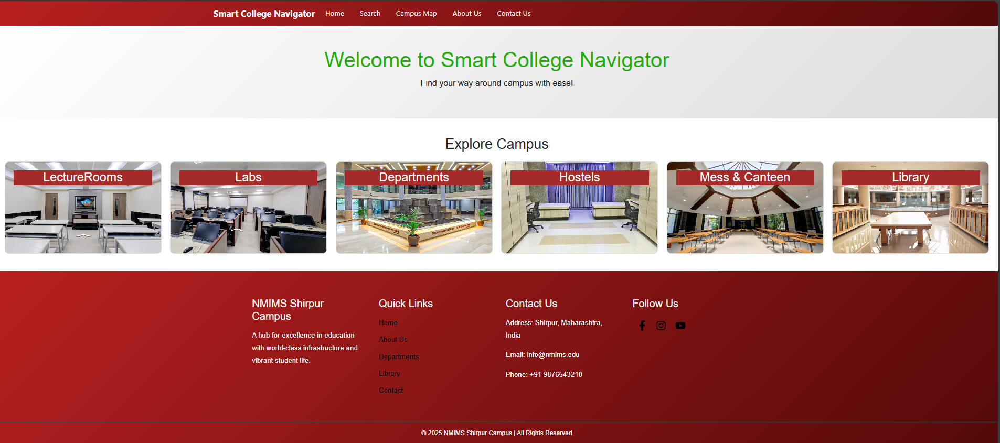
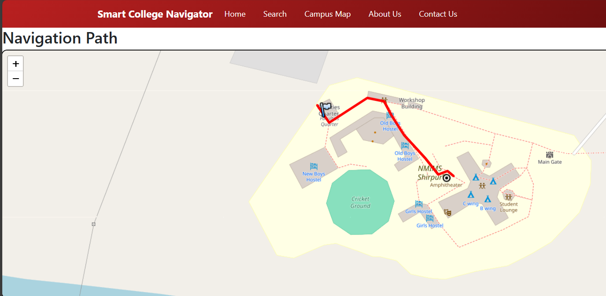
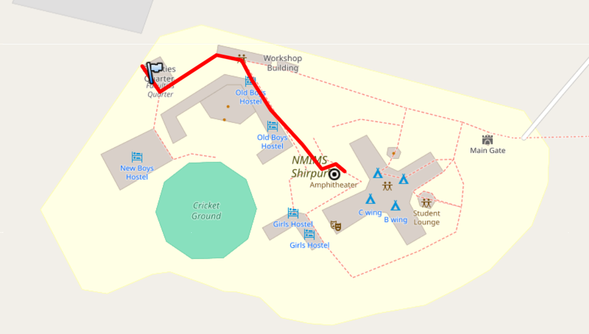
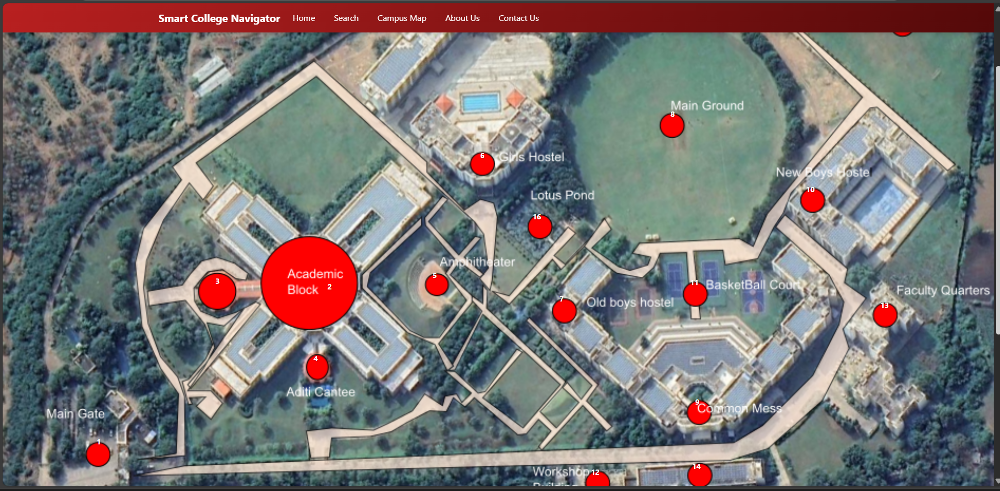
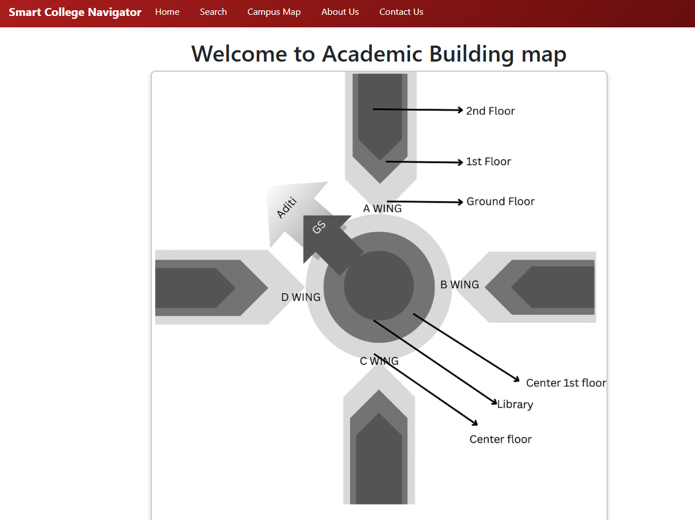
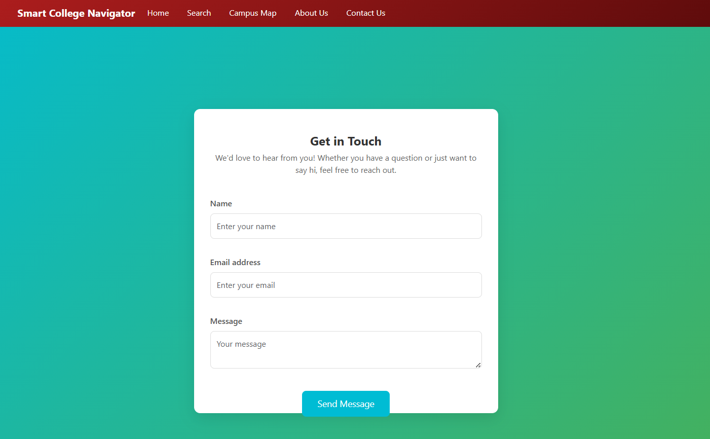
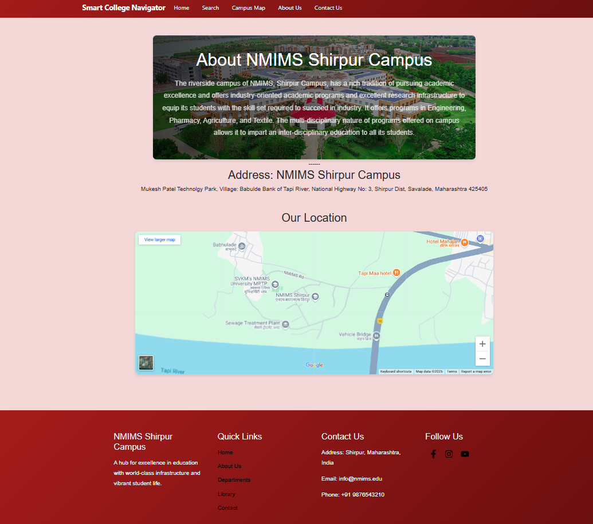

# 🚀 From Concept to Creation: Smart Campus Navigation System 🧭📍

> *“What if we could help students and visitors navigate our campus easily?”*  
What once was just a thought a year ago is now a **fully functional web application** — a moment of immense pride for our team! 🌟

---

## 🔧 Project Highlights

- 🔍 **Source–Destination search** with shortest path generation using **Dijkstra's Algorithm**
- 🗺️ **Custom campus map** built using **OpenStreetMap (.osm)** data
- 🏫 Interactive campus locations: departments, hostels, canteen, mess, library, and more
- 🌀 **360° internal views** linked to key locations on the Home Page
- 🖱️ On-hover **location number + name pop-up** feature
- 📄 Pages included: `Home | About Us | Contact Us | Campus Map`
- 🎥 A detailed **demo video** and **interactive map** interface included!

---

## 🛠️ Tech Stack

- **Frontend**: React.js
- **Backend**: Flask (Python)
- **ML Algorithm**: Dijkstra's Algorithm
- **Map Integration**: OpenStreetMap (.osm)

---

## 📸 Screenshots

| Home Page | Campus Map |
|-----------|-------------|
|  |  |
|  |  |
|  |  |
|  |  |

> *Images are from the `media/` folder in this repository.*

---

## 📄 Academic Contribution

We’ve successfully written a **review paper** on this project under the guidance of our faculty from the **Computer Engineering Department, NMIMS Shirpur**, as part of our Machine Learning coursework.

---

## 👩‍💻 Contributors

 **Mital Patil** 
 --
 **Aarjav Jain** 
 --
 **Sanket Patil** 
 --

---

## 📌 What's Next?

We’re actively working on improvements and planning to **deploy the full version online** soon!  
Have suggestions or feedback? **We’d love to hear from you**!

---

## 🔖 Tags & Hashtags

`#CollegeInnovation` `#CampusTech` `#ReactJS` `#Flask` `#MachineLearning`  
`#OpenStreetMap` `#DijkstraAlgorithm` `#WebDevelopment` `#NMIMS`  
`#StudentProject` `#Teamwork` `#InnovationInEducation` `#SmartCampus`

---

> 💡 _This project isn't just code — it's vision, effort, teamwork, and love for our campus._  
